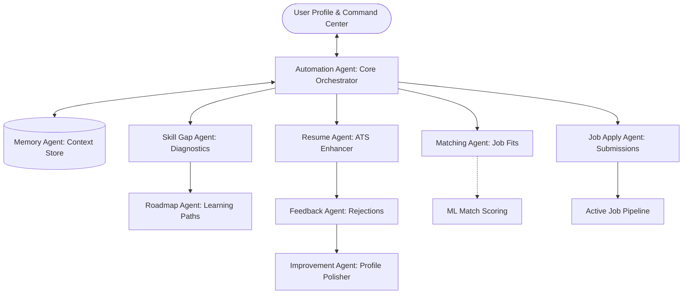

  # 🧭 Career Compass — Autonomous AI Career Command Center


> **A Next-Gen, Recruiter-Ready Portfolio Showcase.**  
> *Empowering job seekers by replacing fragmented spreadsheets and static application processes with a coordinated network of 12 autonomous AI agents.*

---

## 🎯 Project Overview

**Career Compass** is an advanced, production-grade Career Management Platform built to demonstrate high-fidelity UI design, complex React state coordination, and autonomous AI system mock-ups. 

Instead of traditional, static dashboards, Career Compass introduces an **autonomous agent swarm architecture**. Here, twelve specialized virtual agents collaborate concurrently to optimize resumes, evaluate skills, map educational pathways, chat as mock mentors, scrape mock market openings, and manage job application pipelines.

### 🌟 Live Application Highlights (What's in Localhost)
*   **The Command Center:** A glassmorphic dashboard showcasing real-time career readiness, an active application Kanban pipeline, learning progress, and telemetry logs of background agents.
*   **Interactive Agent Orbit:** A custom, physics-like CSS/SVG orbit visualization demonstrating how the autonomous agents revolve around, monitor, and update the user's profile.
*   **ATS Resume Lab:** An interactive workspace allowing users to upload resumes, review automated ATS match scores (broken down by Keywords, Structure, and Impact), inspect version history, and view optimization suggestions.
*   **Real-time AI Career Mentor:** A markdown-supported chat console where users query their Agent Network for resume feedback, interview prep, or career roadmaps with live stream-like UI states.

---

## 🏗️ Technical Architecture & Agent Swarm

At the core of the system is the **Autonomous Agent Network**. The frontend simulates a decoupled, asynchronous agent messaging registry where each agent runs independently to tackle a specific domain:



### The 12 Specialized Agents
| Agent | Role / Domain | Core Simulation Capability |
| :--- | :--- | :--- |
| **🤖 Profile Agent** | Profile Consistency | Structures career details, certifications, and preferences. |
| **📄 Resume Agent** | Resume Optimization | Aligns bullet points with target keywords to bypass ATS filters. |
| **📈 Market Agent** | Trend Tracker | Scans technical job posting trends, salaries, and framework demands. |
| **🎯 Matching Agent** | Compatibility Scorer | Computes role fit percentages against target parameters. |
| **🧠 Skill Gap Agent**| Gap Detection | Identifies missing technologies and cross-references them to market trends. |
| **🎓 Roadmap Agent** | Pathway Constructor | Automatically plots milestone-based courses and resources. |
| **💬 Mentor Agent** | Strategy & Prep | Conducts conversational mock interviews and career planning. |
| **💼 Job Apply Agent** | Application Delivery | Generates tailored application coverages and logs submissions. |
| **🔄 Feedback Agent**| Rejection Analysis | Extracts insights from rejection letters to correct application strategies. |
| **✨ Improvement Agent**| Auto-Refinement | Performs incremental edits on profiles based on feedback loops. |
| **⚡ Automation Agent**| Network Coordinator | Sequences routines and orchestrates agent message-passing. |
| **🗄️ Memory Agent** | Context Retention | Syncs chat sessions, historical versions, and active state variables. |

---

## 🛠️ Technology Stack & Best Practices

This codebase was developed following rigorous frontend guidelines:

*   **Frontend Library:** **React v18** with **Vite** as a lightning-fast build tool.
*   **Language:** Strict **TypeScript** for type-safety across components, agents, and custom hooks.
*   **Aesthetics & Design:** Glassmorphic layout using **Tailwind CSS**, Custom Animations, CSS Variables, and **lucide-react** for modern icon representation.
*   **UI Components:** Built on top of accessible primitives using **shadcn/ui** presets.
*   **Data Fetching & State:** **TanStack Query v5** (React Query) for robust cache management.
*   **Database/Backend Integration:** Ready-to-go integration with **Supabase client** for remote data synchronization.
*   **Testing Suite:** Integrates **Vitest** + **React Testing Library** for component verification.

---

## 🚀 Getting Started

To check out the Career Compass Command Center locally, follow these simple steps:

### Prerequisites
*   [Node.js](https://nodejs.org/) (LTS recommended)
*   [npm](https://www.npmjs.com/) or [Bun](https://bun.sh/)

### Installation

1. **Clone the repository:**
   ```bash
   git clone <YOUR_GIT_URL>
   cd career-compass
   ```

2. **Install project dependencies:**
   ```bash
   npm install
   ```

3. **Start the local Vite dev server:**
   ```bash
   npm run dev
   ```
   Open [http://localhost:5173](http://localhost:5173) in your browser.

4. **Verify codebase tests:**
   ```bash
   npm run test
   ```


